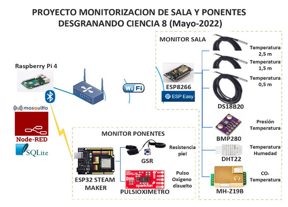

# **Introducción**

En contrucción

En mayo de 2022 se celebró la octava edición del evento “Desgranando Ciencia 8”, organizado por la asociación [*Hablando de Ciencia*](https://granada.hablandodeciencia.com/), en la que el Club Robótica Granada estuvo presente con dos charlas, una sobre la monitorización de la sala del Teatro Isabel la Católica y otra sobre monitorización de ponentes, impartidas por José María Fernández Domenech y Manuel Hidalgo Díaz. [*Video del evento*](https://youtu.be/H6mHUI2tjks), minutos 1:36:23 y 3:18:47

Este proyecto IoT es interesante tanto por la cantidad de magnitudes que se monitorizaron, las arquitecturas empleadas y los sistemas de comunicación utilizados.

Veamos a continuación los dispositivos, comunicaciones, protocolos,... de la monotorización de los ponentes y sala.

En contrucción

