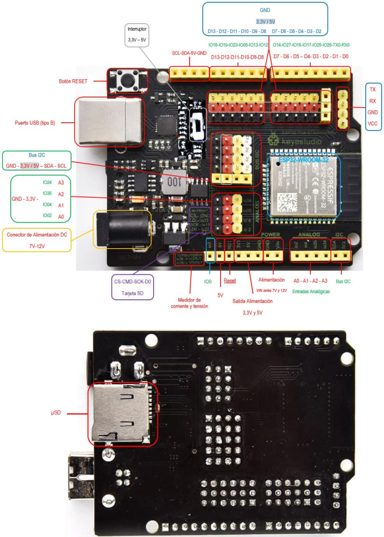
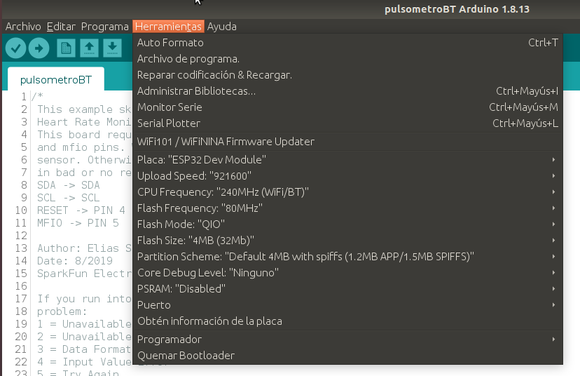

# **ESP32 STEAMakers**
La placa ESP32 STEAMakers controla los sensores para monitorizar a los ponentes. 

- Microcontrolador de 32 bits ESP32-WROOM-32.

- Entradas y salidas digitales con alimentación.

- Entradas analógicas.

- Puerto I2C.

- Conectividad Wifi y Bluetooth integrada en la propia placa.

- Zócalo tarjeta microSD para almacenamiento de datos.

- ...

Placa ESP32 STEAMakers

Más detalle de la placa en los siguientes enlaces:

- [Repositorio de Federico G. Coca](https://fgcoca.github.io/ESP32-STEAMakers/conesp32/)

- [Innova Didactic](https://shop.innovadidactic.com/es/standard-placas-shields-y-kits/1567-placa-esp32-steamakers.html)

Para la programación de la placa se utiliza el IDE Arduino instalando el software correspondiente a las placas ESP32 y seleccionando "ESP32DevModule".

Programación ESP32 STEAMakers

