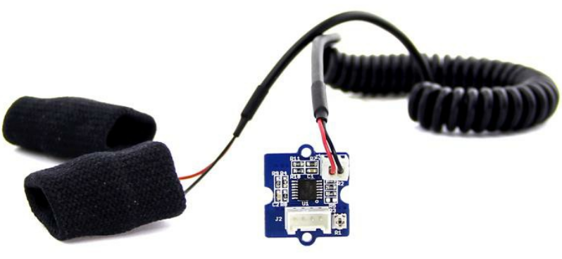
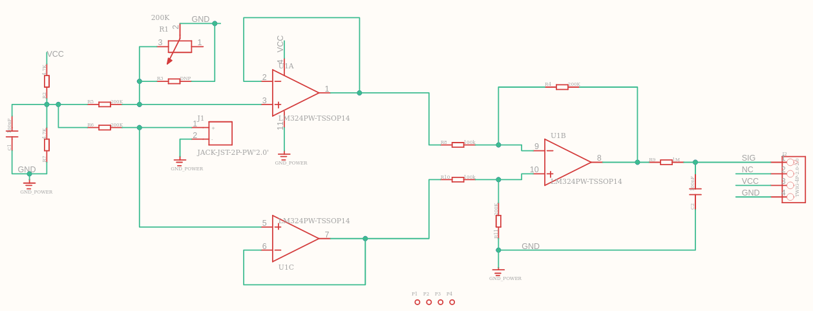

# **Sensor galvánico GSR**
Un sensor galvánico de respuesta de la piel (GSR) mide la resistencia eléctrica de la piel a diferentes niveles de electricidad.

Sensor GSR

Estos sensores detectan cambios sutiles en la conductancia eléctrica cuando estás estresado o ansioso. Por ejemplo, los sensores GSR pueden detectar cambios en la conductancia eléctrica de la piel que se producen cuando la piel está activa (p. ej., sudoración).
[Más información](https://www.ihtbio.com/es/galvanic-skin-response-sensors/).

[wiki (Seed Studio) sensor GSR](https://wiki-seeedstudio-com.translate.goog/Grove-GSR_Sensor/?_x_tr_sl=en&_x_tr_tl=es&_x_tr_hl=es&_x_tr_pto=sc)

Esquema sensor GSR

El sensor tiene 3 terminales alimentación (Vcc, -) y una salida analógica.
El código de un programa de testeo para una placa Arduino.
~~~
const int GSR=A0;
int sensorValue=0;
int gsr_average=0;

void setup(){
    Serial.begin(9600);
}

void loop(){
    long sum=0;
    for(int i=0;i<10;i++)            //suma de 10 medidas
        {
            sensorValue=analogRead(GSR);
            sum += sensorValue;
            delay(5);
        }
    gsr_average = sum/10;           //media de las medidas
    Serial.println(gsr_average);
}

~~~

