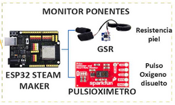
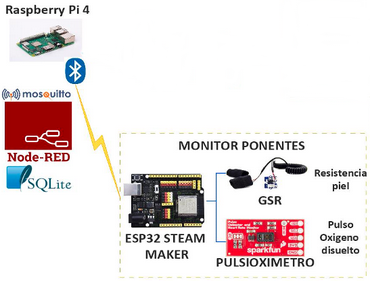
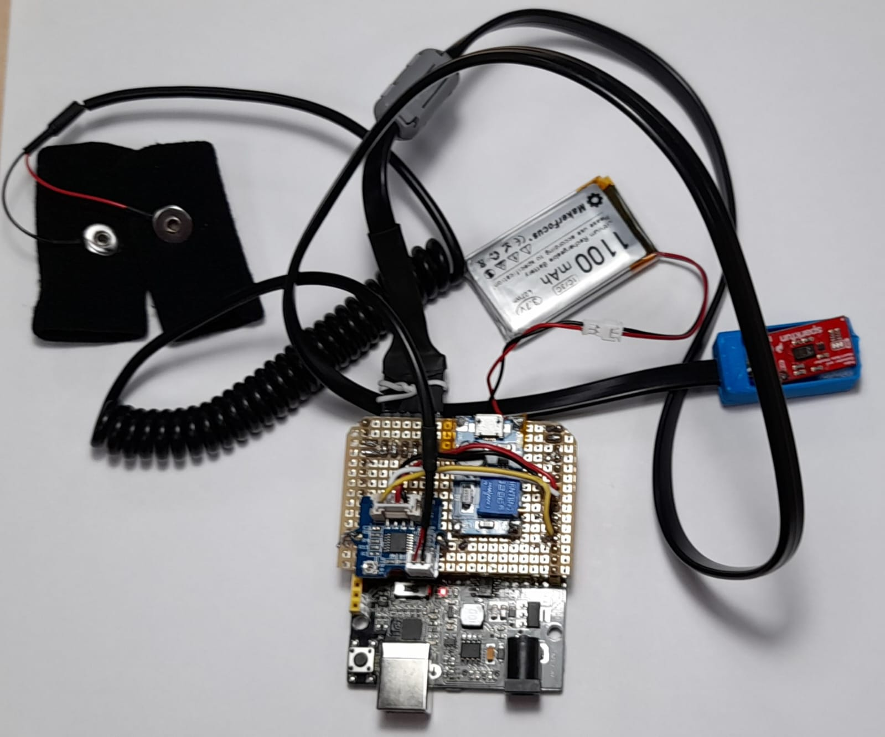

# **Monitorización Ponentes**
La monitorización de los ponentes se realiza con una placa controladora ESP32 STEAMakers, que permite la lectura analógica de un sensor de resistividad de piel y un pulsioxímetro con conexión I2C.

Los datos recogidos por los sensores de transmiten vía bluetooth BLE, entre la ESP32 STEAMakers y la Raspberry Pi, a la aplicación diseñada en Node-RED para su tratamiento y almacenamiento en la base de datos SQLite.

El dispositivo monitor de ponentes para ser autonomo se completa una alimentación formada por un conversor DC/DC y una batería lipo de 3.7V/1.100mAh.

