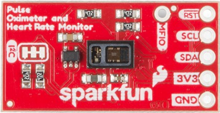
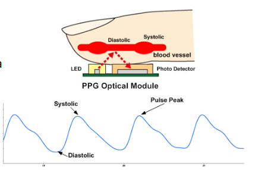

# **Pulsioxímetro**

En contrucción

El pulsómetro y sensor de frecuencia cardíaca es un sensor biométrico que funciona por I2C.

Sensor pulsioximetro

Utiliza dos chips de Maxim: 
 
- El chip MAX30101 sensor pulsómetro y frecuencia cardíaca . 

El MAX30101 realiza toda la detección utilizando sus LED internos para hacer rebotar la luz en las arterias y arteriolas en la capa subcutánea del dedo y detectar cuánta luz se absorbe con sus fotodetectores, [fotopletismografía](https://es.wikipedia.org/wiki/Fotopletismograf%C3%ADa).

Fotopletismografía

Estos datos se transmiten y analizan mediante el MAX32664, que aplica sus algoritmos para determinar la frecuencia cardíaca y la saturación de oxígeno en sangre (SpO2).

- El chip biométrico MAX32664.

 El chip  MAX32664 es un procesador Cortex M4 que maneja todos los cálculos algorítmicos, filtrado digital, compensación de presión/posición, detección avanzada de ondas R y control automático de ganancia.

[El sensor de pulso con oxímetro MAX30101/MAX32664] proporciona como resultados:

- El pulso.

- [La saturación de oxígeno en sangre (SpO2) mide la cantidad de oxígeno que puede transportar la sangre](https://blog.orange.es/producto/monitorizacion-de-spo2-wearables/). 

- La fiabilidad del sensor.

- Informa de la detección del dedos. 

[La placa dispone de una completa librería para Arduino para facilitar el ajuste de todas las configuraciones posibles](https://learn.sparkfun.com/tutorials/sparkfun-pulse-oximeter-and-heart-rate-monitor-hookup-guide#reference-tables-and-sensor-settings).

[Más información en Bricogeek](https://tienda.bricogeek.com/luz-infrarrojos/1514-sensor-de-pulso-con-oximetro-max30101-max32664.html)
