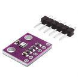
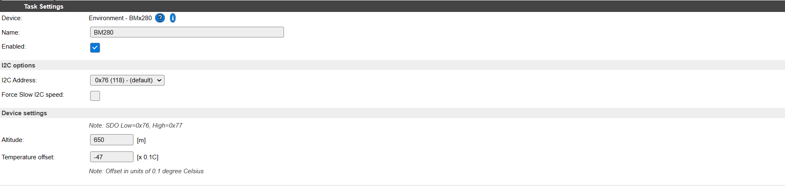
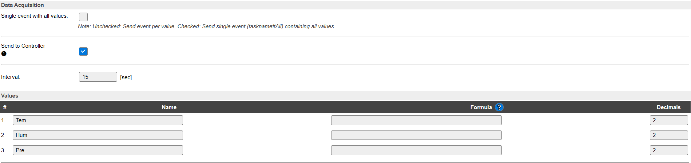

# **Sensor de presión BMP280**
El sensor BMP280 mide la presión barométrica absoluta de forma digital en el rango de 300 a 1100 hPa, con una precisión de +/- 1hPa. Permite la comunicación I2C y SPI, aunque en nuestro caso utilizaremos I2C.

El sensor también proporciona el valor de temperatura interna del módulo, aunque en nuestro caso no lo utilizaremos.

La alimentación del sensor va de 1,8V a 3,6V y tiene un consumo de 2,7µA para una lectura por segundo.

Sensor BMP280

La configuración del sensor BMP280 en el programa ESPEasy solo requiere la dirección del I2C. Los pines utilizados por el I2C se definen en el apartado de Hardware. Si le facilitamos la altura sobre el nivel del mar, la presión barométrica, estará referenciada al nivel del mar y también podemos ajustar un offset para ajustar la lectura de la temperatura.

En la configuración de ESPEasy, aparece también la humedad, pero solo aplica cuando para el sensor BME280. En la figura siguiente se aprecia la configuración requerida para dicho sensor en ESPEasy.

