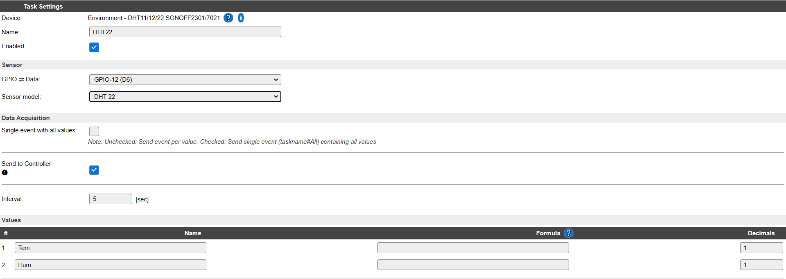

# **Sensor temperatura y humedad DHT22**
El sensor DHT22 es un dispositivo que permite la medida de la temperatura y la humedad relativa del aire. Se comunica a través de un hilo, pero el protocolo es propio del DHT22 y permite la comunicación a distancias de hasta 20 m. El rango de medida de temperatura va de -40ºC a 125ºC, con un error de +/- 0,5ºC y el rango de humedad es de 0 a 100%, con un error +/- 5%.

La alimentación está comprendida entre 3,3V y 6V, con un consumo de 1,5 mA en el ciclo de lectura y 50µA en reposo. El tiempo de lectura será superior a los 2s.

Sensor DHT22

La configuración del sensor DHT22 en el programa ESPEasy solo requiere del numero de pin al que está conectado y el modelo del sensor. En la figura siguiente se aprecia la configuración requerida para dicho sensor en ESPEasy.

Configuración sensor DHT22

