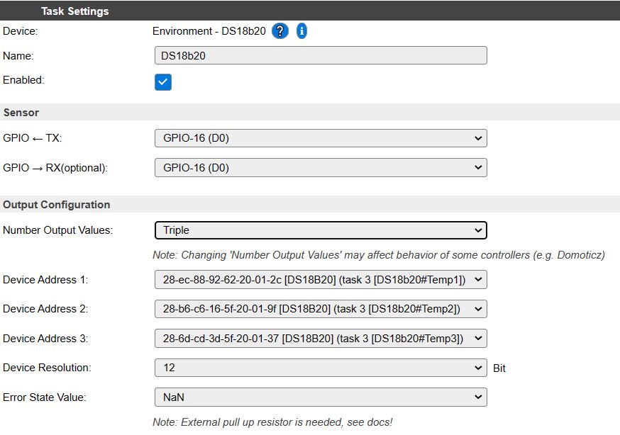
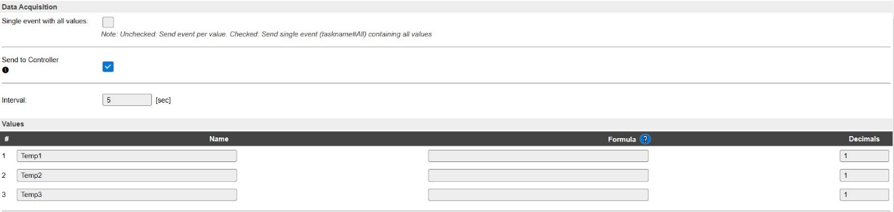

# **Sensor de temperatura DS18B20**
El sensor DS18B20 es un termómetro digital que entrega medidas de temperatura con una resolución de 9 a 12 bits. El dispositivo comunica con el microcontrolador por medio del protocolo 1 wire bus, ya que solo usa un hilo y masa. Cada dispositivo tiene grabado en memoria un código único de 64 bits, lo que permite conectar varios dispositivos en paralelo, utilizando el mismo hilo de comunicación a través de un recinto amplio.

El tiempo de conversión de la temperatura depende de la resolución y va de 94 ms para 9 bit a los 750 ms para 12 bit.

El sensor se puede alimentar con una tensión entre 3 y 5V y puede medir temperaturas en el rango de -55ºC a 125ºC, con un error de +/- 0,5ºC en el rango de -10ºC a 85ºC.

Sensor de temperatura DS18B20

No entraremos en detalle sobre el protocolo de comunicación, ya que el programa ESPEasy, lo único que requiere es saber el pin del microcontrolador al que se ha conectado, la resolución de la medida y la dirección o código del sensor. En nuestro caso utilizaremos el pin GPIO-16(D0) y una resolución de 12 bits. ESPEasy nos permite leer por el mismo pin hasta 4 sensores y en nuestro caso nosotros utilizaremos solo 3.

Hay que tener en cuenta que el código del sensor lo desconocemos ya que dicha información no la suministra el vendedor y por lo tanto tendremos que conectar uno a uno los sensores y anotando el código que lee el programa ESPEasy.

En las figuras siguientes se puede ver la configuración del dispositivo DS18B20 en el programa ESPEasy.

Programando sensor de temperatura DS18B20

En este apartado le indicamos al programa el intervalo de lectura, el controlador ( en nuestro caso MQTT) por el que enviaremos los datos y las etiquetas de los valores que leeremos.

Programando sensor de temperatura DS18B20

