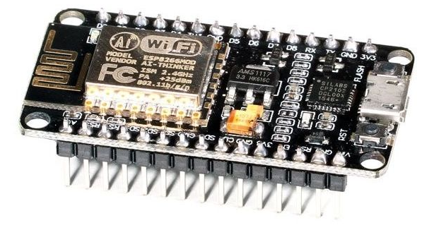

# **ESP8266**
Como se comentó en el apartado anterior se eligió la placa basada en el microcontrolador ESP8266 por la flexibilidad que permite esta placa y por poder correr el programa ESPEasy.

La placa utilizada es la NodeMCU Lua Lolin V3 Module ESP8266 ESP-12F WIFI, que tiene un coste de 7,5€.

Controlador ESP8266

Las características básicas son las siguientes:

- Fabricante Espressif

- Microcontrolador de 3,3 V

- Implementa el estándar WLAN 802.11b/n/g

- Soporta comunicaciones I2C/SPI/UART

- Antena de placa de circuito impresso integrada

La placa viene con las tiras de pines sin soldar y por lo tanto hay que practicar con la soldadura. Para facilitar el conexionado, la placa ESP se montó sobre una placa de circuito impreso perforada, donde se realizaron todas las conexiones.