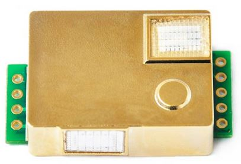
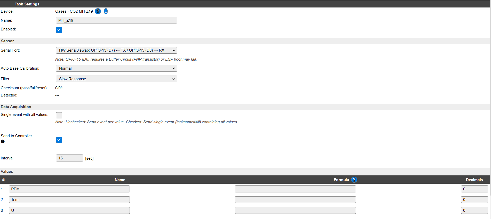

# **Sensor de CO2 HM-Z19B**
El HM-Z19B es un sensor que utiliza el principio NDIR (Non Dispersive Infrared) para detectar la presencia de CO2 en el aire. Dispone de sensor de temperatura incorporado para realizar la compensación de temperatura. La salida de la medida se proporciona mediante un canal de comunicación UART (9600, 8 bytes, 1 stop, no paridad), que es el que utilizaremos, aunque también dispone de salida PWM.

El rango de medida es de 0 a 5000ppm con una precisión de +/- 50ppm y la alimentación va de 3,6V a 5,5V, aunque la interface es a 3,3V.

Sensor HM-Z19B

Para leer este sensor en el programa ESPEasy, solo es necesario identificar los pines para la conexión UART y configurar el filtro y la auto calibración.

En la figura siguiente se puede apreciar la configuración elegida para la lectura del HM-Z19B.

