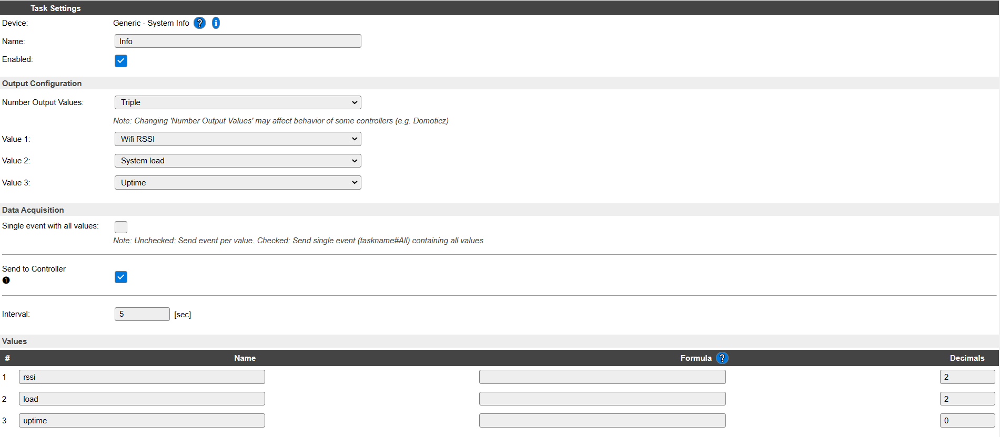
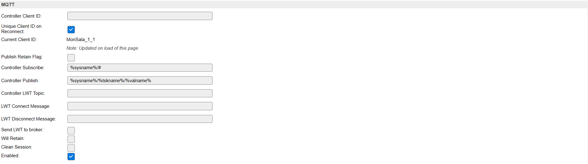
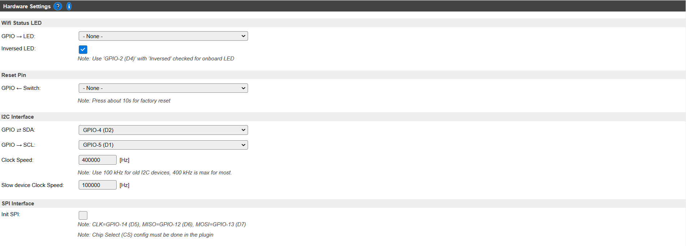
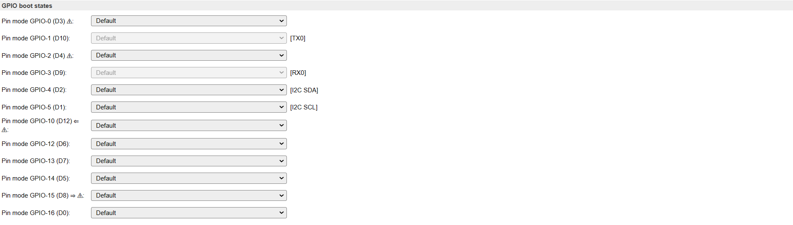

# **Programacion con ESPEasy**
Como hemos comentado anteriormente, el corazón del dispositivo de monitorización de sala es el programa ESPEasy (Open Source), que se puede encontrar en:

 https://github.com/letscontrolit/ESPEasy

La documentación del programa se puede consultar aquí:

https://espeasy.readthedocs.io/en/latest/?badge=latest

ESPEasy soporta una gran cantidad de sensores y visualizadores, vía plugins (Pequeña pieza de código para comunicar con un dispositivo tal como un sensor). Existen varios builds (configuraciones de software), que pueden incluir diferentes plugins, según las necesidades.
En esta página:

https://espeasy.readthedocs.io/en/latest/Plugin/_Plugin.html#list-of-official-plugins

se pueden encontrar todos los dispositivos soportados por ESPEasy. Se puede apreciar que todos los sensores que se han utilizado en el proyecto están recogidos. En esta última revisión, mayo 2022, el BMP280 ha sido retirado y aunque no se incluye en ninguno de los builds, el código fuente está disponible. ESPEasy permite conectar hasta 12 dispositivos y los datos de esos dispositivos se pueden enviar a través de hasta 3 controladores.

En nuestro proyecto hemos incluido un dispositivo genérico con información del sistema y lo hemos configurado para que nos envíe el nivel de señal (RSSI) de la WiFi, la carga del sistema y el tiempo en funcionamiento desde el último encendido.

Aparte de los dispositivos, en ESPEasy existen plugins para los controladores, que son los encargados de enviar los datos y en esta página, se encuentran todos los controladores disponibles. 

https://espeasy.readthedocs.io/en/latest/Controller/_Controller.html

ESPEasy permite instalar hasta 3 controladores. En nuestro caso hemos utilizado el controlador “Home Assistant (openHAB) MQTT”, ya que nos comunicaremos con la unidad de monitorización por el protocolo MQTT. La configuración de este controlador es la siguiente:

También existe una configuración para el equipo, en la que se incluyen datos de los pines utilizados para I2C, SPI, si se utiliza un pin para un LED, o si se utiliza un pin para realizar el reset. También permite configurar el estado de los pines en el arranque.

En nuestro proyecto realizamos un build a medida a través de Platformio y VS Code, pero eso da para un taller entero y no lo trataremos aquí.
