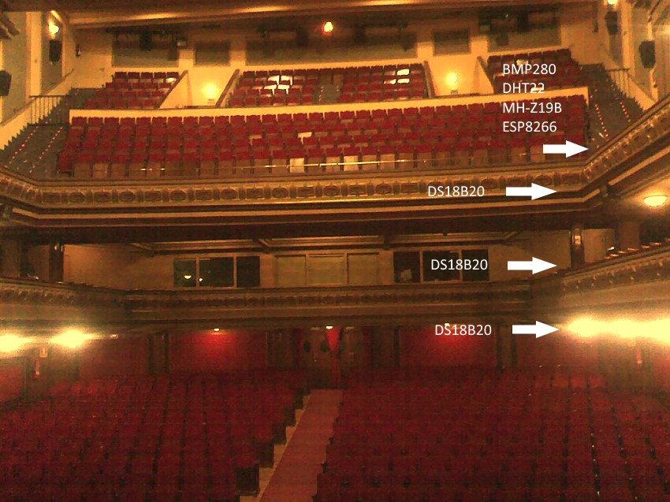
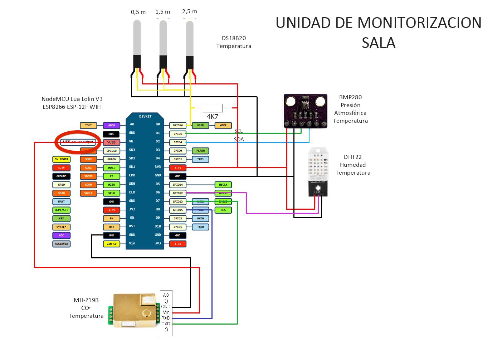
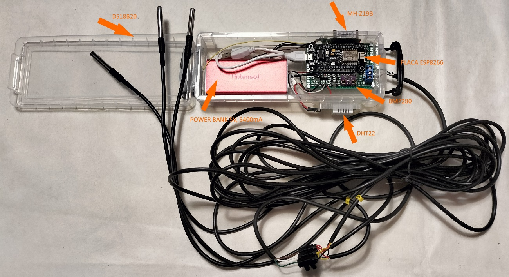
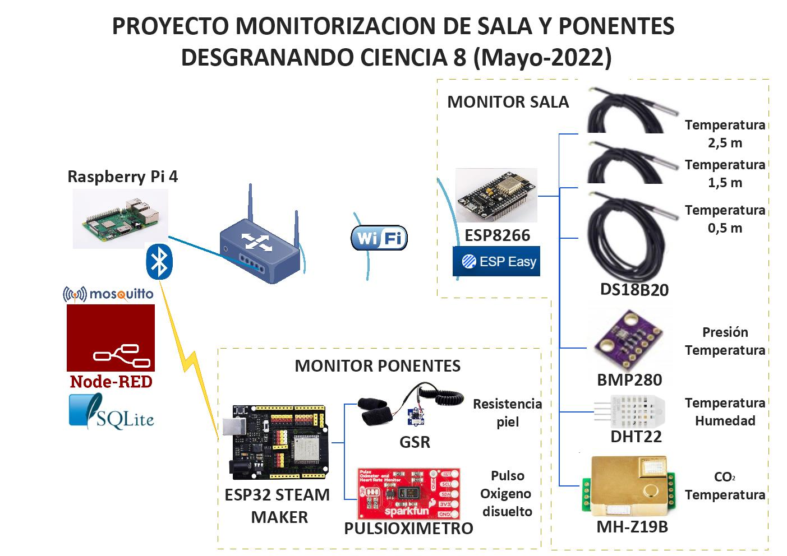

# **Introducción**
Unas de las premisas de la organización era la de monitorizar el ambiente de la sala del teatro Isabel la Católica en tiempo real y analizar el comportamiento del sistema de climatización y ventilación en presencia de espectadores.

Dada la magnitud de la sala hubiera sido necesario utilizar una gran cantidad de sensores, pero dadas las limitaciones, se optó por medir la temperatura a cuatro alturas distintas, la humedad relativa el porcentaje de CO2 y la presión atmosférica.

Con la medida de la temperatura en cuatro alturas, se pretendía comprobar la estratificación del aire en la sala y ver el comportamiento del sistema de climatización y ventilación del teatro. 
La medida de la humedad nos daría una idea de como afecta la respiración del público y cómo responde el sistema de climatización.

Otra magnitud a medir era la concentración de CO2 en el aire, y ver la eficiencia del sistema de ventilación.

La medida de la presión atmosférica no tenía relevancia en la monitorización de la sala, pero se decidió incluirla con fines didácticos. Esta medida de la presión se podría usar para calcular las variables psicométricas del aire de la sala, pero se optó por medir y representar el valor. 

La instrumentación que se eligió estaba formada por:

- 3 sensores de temperatura con vaina y 3 metros de longitud, del tipo DS18B20.

- 1 sensor DHT22 para la medida de la cuarta temperatura y la humedad relativa.

- 1 sensor de concentración de CO2 del tipo MH-Z19B.

- 1 sensor de presión atmosférica del tipo BMP280.

En la figura siguiente se puede apreciar la ubicación de los sensores.

Ubicación de los sensores en el teatro

Quedaba entonces elegir que plataforma utilizar para leer los datos de todos los sensores y enviar la información a la unidad de visualización. Después de analizar las opciones, se decidió utilizar una placa con procesador ESP8266, en concreto la placa NodeMCU Lua Lolin V3 Module ESP8266 ESP-12F WIFI. A continuación, se muestra el conexionado de la placa y el montaje del conjunto.

Esquema conexionado

Sistema monitorizacion sala

Por último, había que elegir como programar la placa ESP y se decidió utilizar el programa ESPEasy, que permite trabajar con una gran cantidad de sensores y en concreto tiene soporte para los sensores elegidos, sin necesidad de programar código. Toda la configuración se realiza vía Web.

La comunicación entre la placa de los sensores y la unidad de visualización se realizó mediante la red WiFi, utilizando el protocolo MQTT, integrado en el software ESPEasy. Para no depender de la red del teatro, se creó una red propia para la monitorización, utilizando un router inalámbrico. En la figura siguiente se muestra la arquitectura utilizada.

Sistema monitorizacion sala y ponentes

Quedaba elegir la alimentación de la placa y dado que no se disponía de tomas de corriente en la ubicación de la placa, se optó por utilizar una power bank de 5V, con autonomía suficiente para la duración del evento.
En los apartados siguientes analizaremos uno a uno los componentes de la unidad de monitorización de sala.